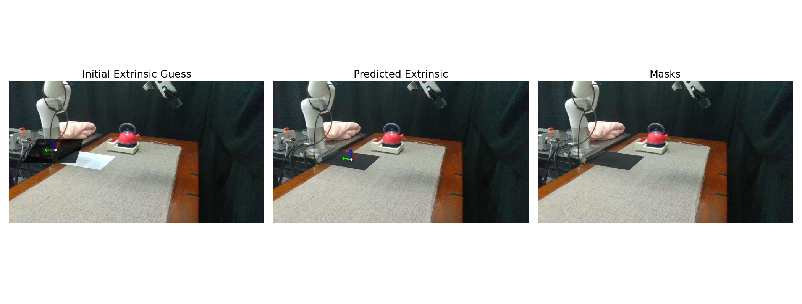

# Simple EasyHec: Accurate and Automatic Camera Calibration

> This repo provides (mostly) pip installable code to easily calibrate a camera (mounted and not mounted) and get its extrinsics with respect to some object (like a robot). It is a cleaned up and expanded version of the original [EasyHeC project](https://github.com/ootts/EasyHeC). It works by taking a dataset of segmentation masks of the object, the object's visual meshes, and the object poses, and based on the camera intrinsics and an initial guess of the extrinsics, optimizes that guess into an accurate estimate of the true extrinsics (translation/rotation of a camera in the world). The optimization process leverages [Nvdiffrast](https://github.com/NVlabs/nvdiffrast) for differentiable rendering to run this optimization process.

> Below shows the progression of the optimization of the extrinsic prediction. The first image shows the bad initial guess, the second image shows the predicted extrinsics, the third image shows the segmentation masks (generated with Segment Anything Model 2). The shaded mask in the first two images represent where the renderer would render the object (the paper) at the given extrinsics.


We also provide some real/simulated examples that calibrate with a robot


## Installation

```bash
git clone git@github.com:xiaojxkevin/simple-easyhec.git
conda create -n simplehec "python==3.11"
pip install torch==2.5.1 torchvision==0.20.1 --index-url https://download.pytorch.org/whl/cu121
pip install -e .
# nvdiffrast
pip install "nvdiffrast @ git+https://github.com/NVlabs/nvdiffrast.git@729261dc64c4241ea36efda84fbf532cc8b425b8"
# sam2
cd ../sam2
pip install -e .
cd ../simple-easyhec
```

> The code relies on Nvdiffrast and [SAM2](https://github.com/facebookresearch/sam2) which can sometimes be tricky to setup as it can have some dependencies that need to be installed outside of pip. If you have issues installing Nvdiffrast (which provides dockerized options) see their [documentation](https://nvlabs.github.io/nvdiffrast/) or use our google colab script.

## Usage

> We provide some already pre-written scripts using EasyHec, but many real-world setups differ a lot. We recommend you to copy the code and modify as needed. In general you only really need to modify the initial extrinsic guess and how you get the real camera images (for eg other cameras or multi-camera setups).

### Output Files

Each calibration script saves the following `.npy` files under the output directory:

### Notation

All transformation matrices use the convention:

$$P^A = T^A_B \cdot P^B$$

where $T^A_B$ transforms a point from frame $B$ to frame $A$.

| File | Convention | Symbol | Meaning |
|------|-----------|--------|---------|
| `camera_extrinsic_opencv.npy` | OpenCV | $T^{cam}_{world}$ | Transforms a point from world to camera: $P^{cam} = T^{cam}_{world} \cdot P^{world}$. OpenCV optical axes: +X right, +Y down, +Z forward. |
| `camera_extrinsic_ros.npy` | ROS | $T^{world}_{cam}$ | Camera pose in world (inverse of OpenCV extrinsic): $P^{world} = T^{world}_{cam} \cdot P^{cam}$. ROS optical axes: +X forward, +Y left, +Z up. |
| `camera_intrinsic.npy` | OpenCV | $K$ | 3×3 intrinsic matrix: `[[fx, 0, cx], [0, fy, cy], [0, 0, 1]]`. |

Both extrinsic matrices are 4×4 homogeneous: `[[R, t], [0, 0, 0, 1]]`.

**For `paper.py`**: world = paper frame (origin at paper center, +Z upward, X/Y in paper plane).

**For robot scripts (xarm6, piper, etc.)**: world = robot base frame.

### Paper

[Script Code](./easyhec/examples/real/paper.py)

The script below will take one picture, ask you to annotate the paper to get a segmentation mask, then it optimizes for the camera extrinsics one shot. By default the optimization will be made such that the world "zero point" is at the exact center of the paper. The X,Y axes are parallel to the paper's edges, and Z is the upwards direction. Results are saved to `results/paper`.

```bash
pip install pyrealsense2 # install the intel realsense package

python -m easyhec.examples.real.paper \
  --paper-type a4 \
  --model-cfg ../sam2/configs/sam2.1/sam2.1_hiera_l.yaml \
  --checkpoint ../sam2/checkpoints/sam2.1_hiera_large.pt \
  --realsense_camera_serial_id 231522072820

python -m easyhec.examples.real.paper \
  --camera-type zed \
  --zed-camera-resolution HD720 \
  --camera-fps 30 \
  --paper-type a4 \
  --model-cfg ../sam2/configs/sam2.1/sam2.1_hiera_l.yaml \
  --checkpoint ../sam2/checkpoints/sam2.1_hiera_large.pt

```

### xArm6

[Script Code](./easyhec/examples/real/xarm6.py)

```bash
python -m easyhec.examples.real.xarm6 \
  --xarm-ip 192.168.2.202 \
  --realsense-camera-serial-id 231522072820 \
  --num_manual_samples 4 \
  --model-cfg configs/sam2.1/sam2.1_hiera_l.yaml \
  --checkpoint /media/sealab/data/xiaojx/sam2/checkpoints/sam2.1_hiera_large.pt
```

By default, this script uses manual capture only: you move the robot yourself, then press Enter to record the current pose and image. It also defaults to `use_gripper=False`, in which case it will automatically use `easyhec/examples/real/robot_definitions/xarm6/xarm6_nogripper.urdf`.

If you want to calibrate with the gripper included, enable `--use-gripper True`. In that case, if `--urdf-path` is not provided, the script will automatically use `easyhec/examples/real/robot_definitions/xarm6/xarm6_gripper.urdf`.

For eye-to-hand calibration, one practical difficulty is getting a reasonable initial extrinsic guess. In our xArm6 setup, a good workflow is to first use an A4 sheet of paper to gradually confirm the camera position, then transfer that paper-based result into the robot base frame as the initial guess for robot calibration.

#### Paper-Assisted Initialization

1. Place an A4 sheet flat on the table near the robot base.
2. Run the paper calibration script and annotate the paper mask:
   ```bash
   python -m easyhec.examples.real.paper --paper-type a4 ...
   ```
3. Check the visualization in `results/paper/0.png` to confirm the recovered paper frame is correct.
   
4. The paper calibration saves `camera_extrinsic_opencv.npy` ($T^{cam}_{paper}$). The script `xarm6.py`'s `resolve_initial_extrinsic_guess()` already loads this file via `np.load`.
5. Define the paper→base transform by editing the $T^{paper}_{base}$ matrix in `resolve_initial_extrinsic_guess()`:
   - **Rotation**: how the robot base axes relate to the paper axes. Since both Z axes point up (perpendicular to the table), the rotation is primarily a yaw angle θ around Z.
   - **Translation**: the offset from the paper center to the robot base origin, measured in the paper frame (meters).
6. The function computes $T^{cam}_{base} = T^{cam}_{paper} \cdot T^{paper}_{base}$ as the initial guess, then runs the xArm calibration.

This paper-assisted step is not the final calibration by itself. It is a convenient way to reduce the search space and make the robot calibration converge much more reliably, especially when the camera is mounted far from the robot or the default hand-written initial guess is too rough.

### Piper + ZED

[Script Code](./easyhec/examples/real/piper.py)

This script calibrates an external ZED camera against the Piper base frame. It uses the ZED left RGB stream and reads live Piper joint feedback through `piper_sdk` while you manually drag the robot to each calibration pose.

Install the Piper and ZED Python dependencies inside the `simplehec` environment:

```bash
pip install piper_sdk python-can
python /usr/local/zed/get_python_api.py
```

You can refer to [cmds](./cmds/piper_sdk) to config piper can ports.

Then run manual capture calibration:

```bash
python -m easyhec.examples.real.piper \
  --can-name can_right_slave \
  --camera-resolution HD720 \
  --camera-fps 30 \
  --num-manual-samples 4 \
  --model-cfg ../sam2/configs/sam2.1/sam2.1_hiera_l.yaml \
  --checkpoint ../sam2/checkpoints/sam2.1_hiera_large.pt
```

The script does not command robot motion. Put Piper in teaching/manual mode, move it to a visible pose, wait until it is stationary, and press Enter when prompted. Results are saved under `results/piper/piper_description_v100_camera/base_camera`.

If you only want to retry segmentation/optimization after collecting data, rerun with `--use-previous-captures True`. If your CAN feedback path requires the SDK enable helper, add `--allow-mode-switch True`.

## Tuning Tips

- It is recommended to get a diverse range of sample images that show the robot in different orientations. This is particularly more important for wrist cameras, which often only see the robot gripper. This is also more important for more complicated robots in more complicated looking scenes where segmentation masks may not be perfect.
- The initial guess of the camera extrinsics does not have to be good, but if the robot is up very close it may need to be more accurate. This can be the case for wrist cameras.
- To ensure best results make sure you have fairly accurate visual meshes for the robot the camera is attached on / is pointing at. It is okay if the colors do not match, just the shapes need to match.
- While it is best to have accurate visual meshes, this optimization can still work even if you don't include some parts from the real world. It may be useful to edit out poor segmentations.
- It is okay if the loss is in the 1000s and does not go down. Loss values do not really reflect the accuracy of the extrinsic estimate since it can depend on camera resolution and how far away the robot is.

## Citation

If you find this code useful for your research, please use the following BibTeX entries

```
@article{chen2023easyhec,
  title={EasyHec: Accurate and Automatic Hand-eye Calibration via Differentiable Rendering and Space Exploration},
  author={Chen, Linghao and Qin, Yuzhe and Zhou, Xiaowei and Su, Hao},
  journal={IEEE Robotics and Automation Letters (RA-L)}, 
  year={2023}
}
@article{Laine2020diffrast,
  title   = {Modular Primitives for High-Performance Differentiable Rendering},
  author  = {Samuli Laine and Janne Hellsten and Tero Karras and Yeongho Seol and Jaakko Lehtinen and Timo Aila},
  journal = {ACM Transactions on Graphics},
  year    = {2020},
  volume  = {39},
  number  = {6}
}
@article{ravi2024sam2,
  title={SAM 2: Segment Anything in Images and Videos},
  author={Ravi, Nikhila and Gabeur, Valentin and Hu, Yuan-Ting and Hu, Ronghang and Ryali, Chaitanya and Ma, Tengyu and Khedr, Haitham and R{\"a}dle, Roman and Rolland, Chloe and Gustafson, Laura and Mintun, Eric and Pan, Junting and Alwala, Kalyan Vasudev and Carion, Nicolas and Wu, Chao-Yuan and Girshick, Ross and Doll{\'a}r, Piotr and Feichtenhofer, Christoph},
  journal={arXiv preprint arXiv:2408.00714},
  url={https://arxiv.org/abs/2408.00714},
  year={2024}
}
```
